# chess-analysis-board
A chessboard for the browser in vanilla

##  DEVELOPMENT
Installation, Development, Test, Build

- `npm i`
- `npm start`
- `npm run build`
- `npm run test`

## TECH STACK

- Vanilla
- Sass
- Jest
- Webpack
- cypress
- jest

## QUICK USAGE

1. Place the pieces on the board:
   1. by load fen notation
   2. manually places pieces
2. Select squares and click in panel options to visualize:
   1. pieces allowed squares
   2. most attacked squares
   3. supported pieces, to better plan an attack
   4. ...

## LIVE DEMO

[http://motuo.info/chess/](http://motuo.info/chess/)

## FEATURES

### Overview
- Game
  - Record
  - Previous
  - Next
- Visualization analyse
  - Square support
  - Square danger
  - Square attack
  - Piece domain
  - Piece domain attack
  - Piece domain danger
  - Piece domain support
  - Domain toggle
  - Domain white
  - Domain black
  - Report balance white
  - Report balance black
  - Toggle visuals
  - Flank center (to do)
  - Flank king (to do)
  - Flank queen (to do)
-  Markers
   - Circle white
   - Circle black
   - Circle neutral
   - Dot ( last move)
   - Square green
   - Square red
- Pieces
  - add/remove
  - clear selected square
- Board
  - Flip
  - Clear
  - Reset
  - Fen to board
  - Board to fen
  - Copy Link
  - Pgn to board

### Clear board

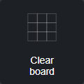
 
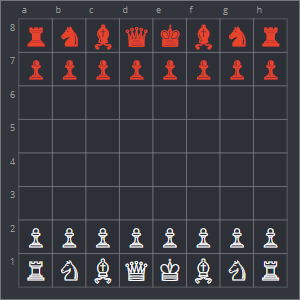
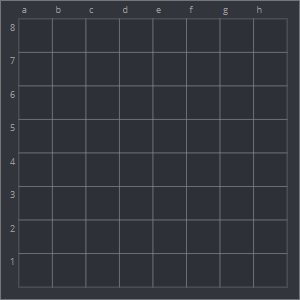

### Square attack

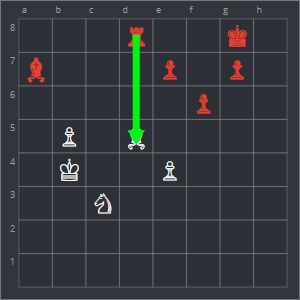

### Domain black

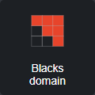
 
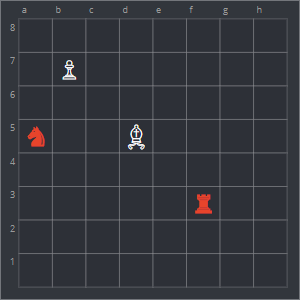
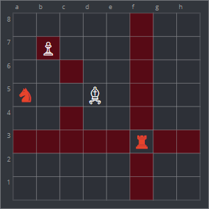

### Domain toggle

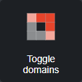

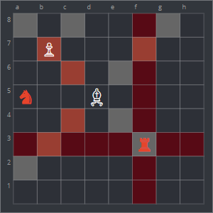

### Domain white

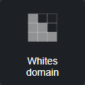
 

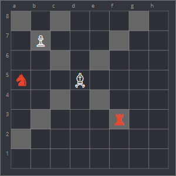

### Fen to board

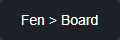
 

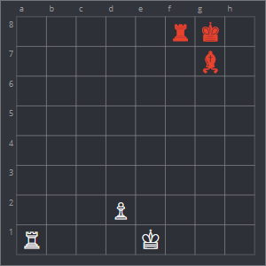

### Board flip

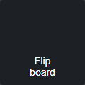
 

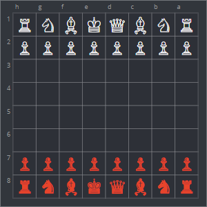

### Piece domain attack

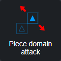
 

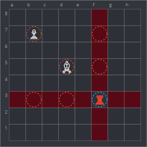

### Piece domain danger

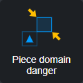
 
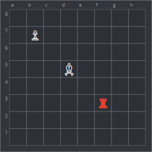
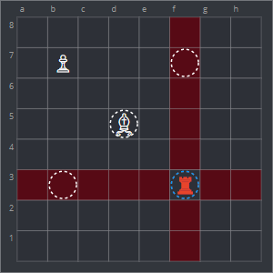

### Piece domain support

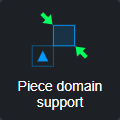
 

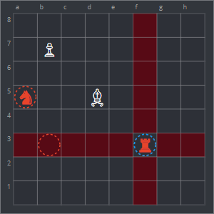

### Piece domain

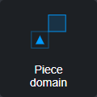
 
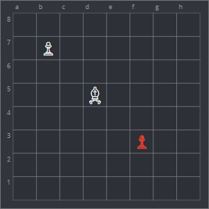
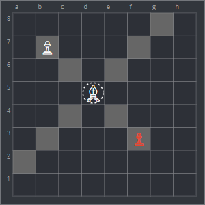

### Reset board

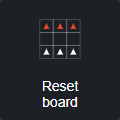
 

### Square attack

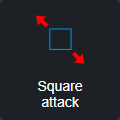
 
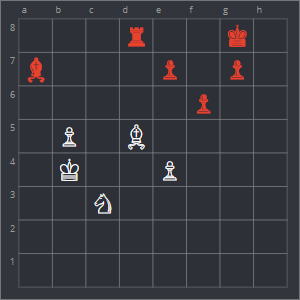
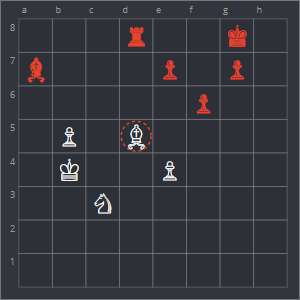
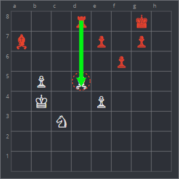

### Square danger

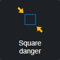
 

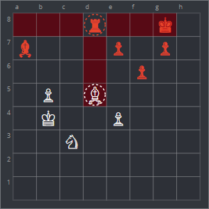

### Square support

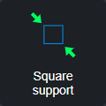
 

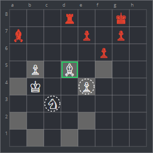

## NOTICE

The project does not provide a game engine :)

## NEXT FEATURES