# chess-analysis-board
A chessboard for the browser in vanilla

##  DEVELOPMENT
Installation, Development, Test, Build

- `npm i`
- `npm start`
- `npm run build`
- `npm run test`

## TECH STACK

- Vanilla
- Sass
- Jest
- Webpack

## QUICK USAGE

1. Place the pieces on the board:
   1. by load fen notation
   2. manually places pieces
2. Select squares and click in panel options to visualize:
   1. pieces allowed squares
   2. most attacked squares
   3. supported pieces, to better plan an attack
   4. ...

## FEATURES

### BOARD AND PIECES
By default, all pieces are shown in their initial position.
It is possible to empty the board and position the pieces.

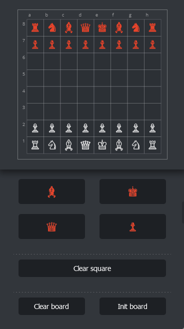

- Load Initial position
- Flip board
- Add/remove pieces
- Clear board
  
#### FEN PARSER

It is possible to initialise the position of the parts by a fen notation.

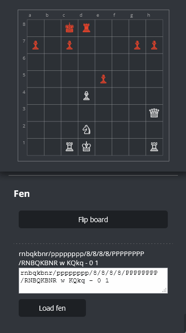

--- 

### MARKERS

#### List of markers:
- White: dotted circle white
- Black: orange dotted  circle 
- Neutral: blue dotted   circle
- Right move: green rect 
- Wrong move: red rect 
- Last move: black filled circle

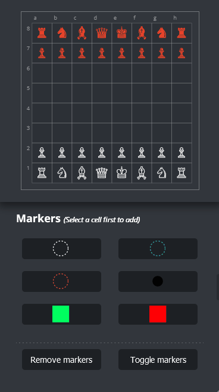

####  Usage

- **add**:  to add a marker select first s square and dann the marker.
- **remove**:  to remove a marker, select first the square

--- 

### VISUALIZATION OF DOMAINS

#### SQUARE DOMAIN
By selecting a cell, it allows you to visualise the allowed cells for the figure.  

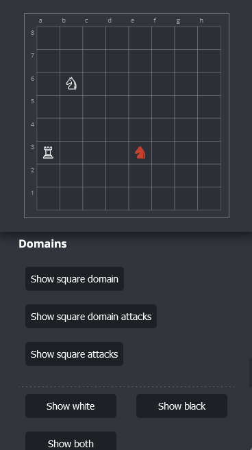

#### COLOR DOMAIN
Allows you to visualise all the squares that are attacked by all the pieces of a chosen colour.

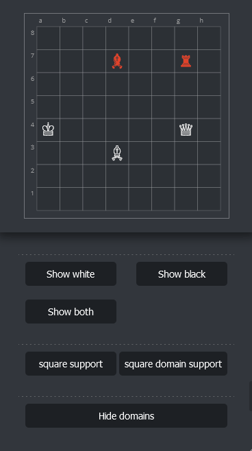

#### SUPPORT

It allows to visualise which pieces are supported by other pieces, in the own square or in the allowed squares.

##### DOMAIN SUPPORT 
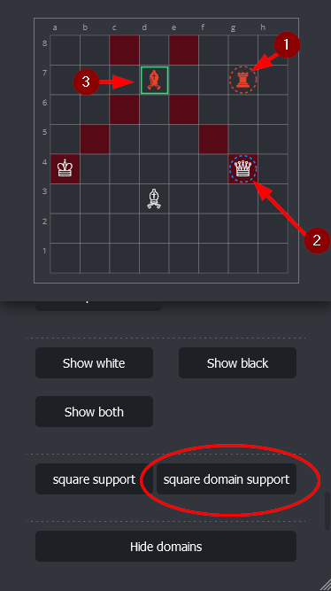

##### OWN SQUARE SUPPORT
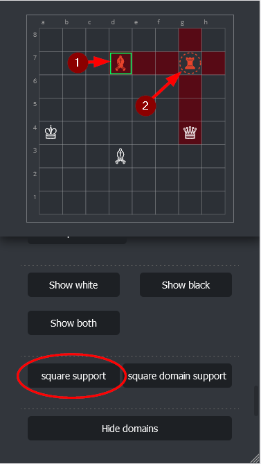

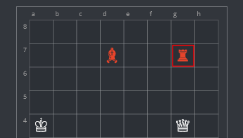

--- 

## GAME EXAMPLES

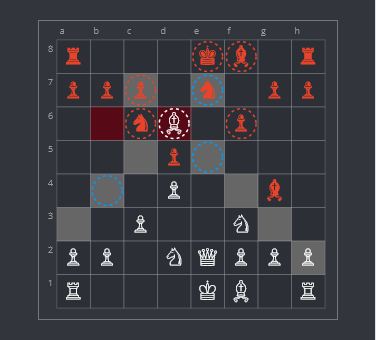

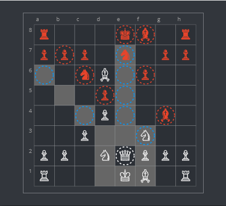

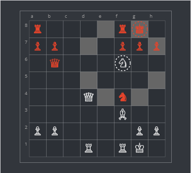

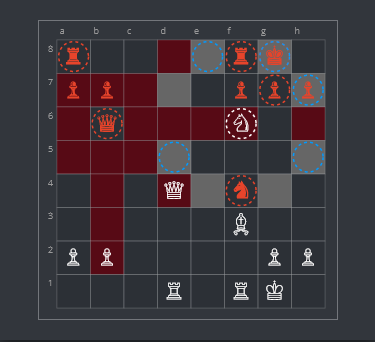

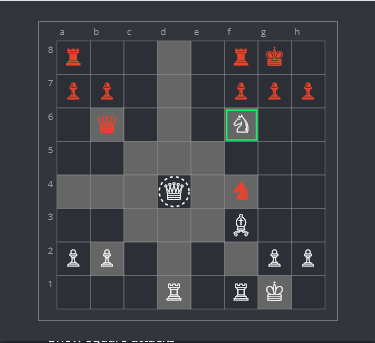

### GAME EXAMPLE

Wilfried Hoellrigl vs Alexander Baburin  
Oberwart Open (1991), Oberwart AUT, Jul-??   
**fen:** `2r1r1k1/4qppp/1Rp5/2Ppb3/8/3Q4/4NPPP/1R4K1 w - - 2 27`

**Black Queen - attacked squares**
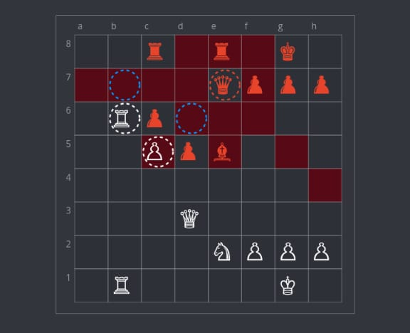

**White Rook - attacked squares**
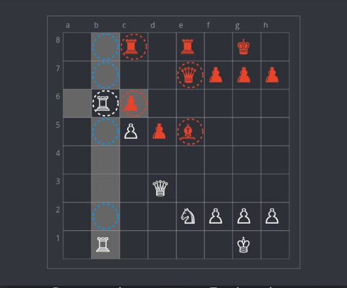

**White Queen - supported squares, colors domains**
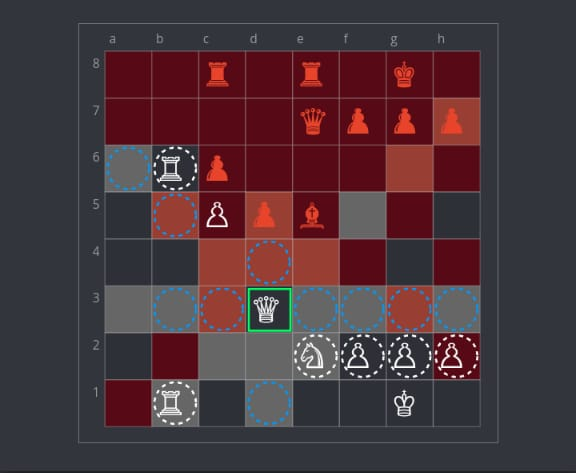

**White Pieces - supported**
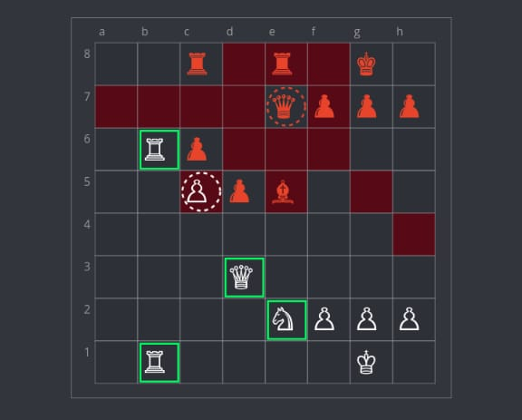

**White Rook - attacked squares**
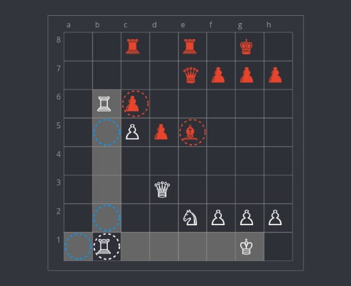

**White Pieces - attacked**
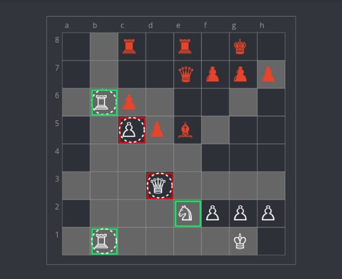

## NEXT FEATURES

1. Pieces in svg
2. Draw 
   1. Arrows
   2. Flanks
3. Moves:
   1. save moves
   2. clear moves
   3. remove from play
   4. import / export

