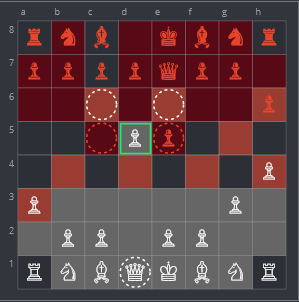
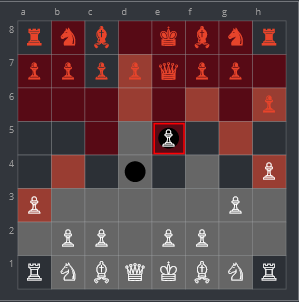
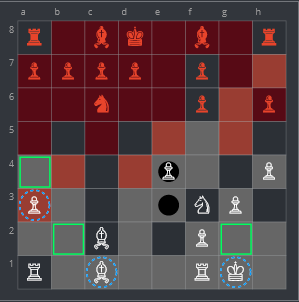

# Game compare

## Game data

```
[Event "vs bot"]
[Site "xxx.xxx"]
[Date "??.??.??"]
[Round "?"]
[White "userA"]
[Black "bot"]
[Result "1-0"]
[ECO "A40"]
[WhiteElo "748"]
[BlackElo "1300"]
[TimeControl "0"]
[EndDate "xxxx.xx.xx"]
[Termination "userA won by checkmate"]

1. d4 e6 2. g3 Qe7 3. a3 h6 4. h4 e5 5. b4 Nc6 6. e3 exd4 7. Bg2 Ne5 8. Qxd4 a5
9. Nc3 Nc6 10. Qe4 Qxe4 11. Bxe4 axb4 12. Nd5 Kd8 13. Nf3 b3 14. O-O bxc2 15.
Bxc2 Nf6 16. Nxf6 gxf6 17. e4 Ne5 18. Nd4 d5 19. Bb2 c6 20. exd5 Bc5 21. Nf5
Bxf5 22. Bxf5 cxd5 23. Rad1 d4 24. Rc1 Ra5 25. Be4 Re8 26. Bxb7 Nd3 27. Rc2 Re6
28. Bxd4 Bxd4 29. Rc8+ Kd7 30. Rc4 Bc5 31. Rd1 Kc7 32. Rxd3 Re1+ 33. Kg2 Kxb7
34. Rd7+ Ka6 35. Rxf7 Re7 36. Rxf6+ Kb5 37. Rcf4 Ra8 38. Rxh6 Rc7 39. g4 Rcc8
40. Rf5 Ra4 41. Rd6 Rg8 42. f3 Ra5 43. g5 Ra4 44. Rd7 Rf8 45. Rb7+ Ka6 46. Rxf8
Kxb7 47. Rf7+ Kc6 48. g6 Bd6 49. g7 Ra8 50. h5 Kd5 51. h6 Kc6 52. h7 Be5 53.
g8=Q Rxg8+ 54. hxg8=Q Bd6 55. Qc8+ Kd5 56. Rf5+ Kd4 57. Qh8+ Kd3 58. Rd5+ Kc2
59. Rxd6 Kb3 60. Rb6+ Kc4 61. Qc8+ Kd5 62. Qe6+ Kd4 63. Qe4+ Kc3 64. Qb4+ Kc2
65. Qb2+ Kd1 66. Rd6+ Ke1 67. Qd2# 1-0
```

## Moves

#### 2

Description ...  


#### 3

Description ...  


#### 4

Description ...  


#### 5

Description ...  





#### 6

Description ...  


#### 7

Description ...  


#### 9

Description ...  


#### 10

Description ...  


#### 11

Description ...  


#### 13

Description ...  


#### 14

Description ...  


#### 17

Description ...  




#### 20

Description ...  


#### 21

Description ...  


#### 23

Description ...  


